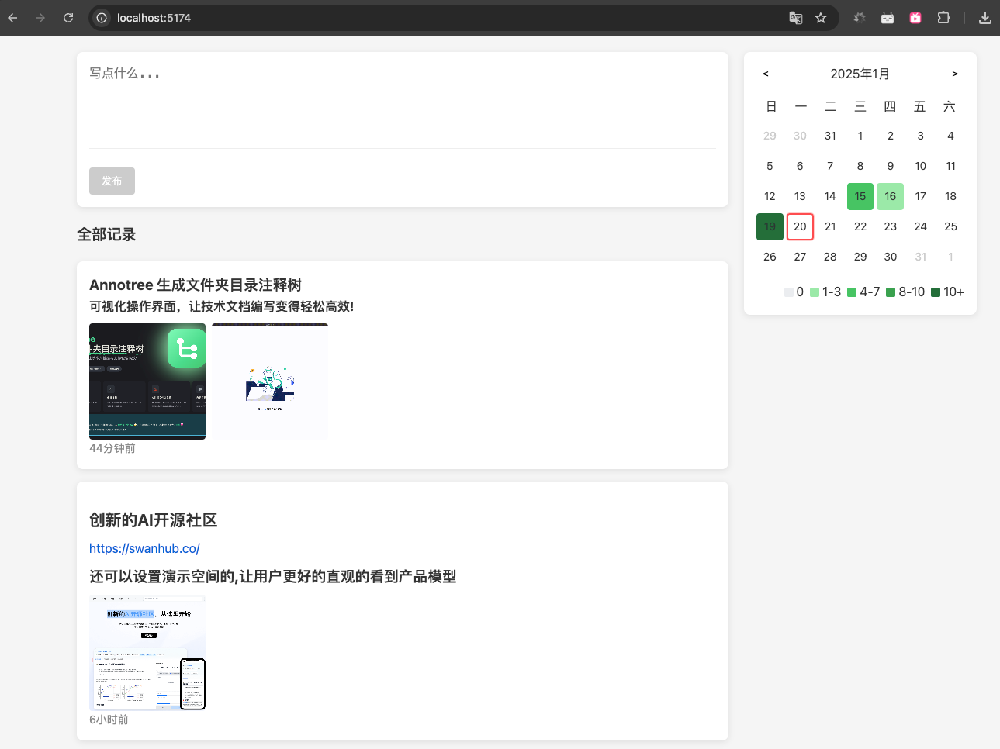
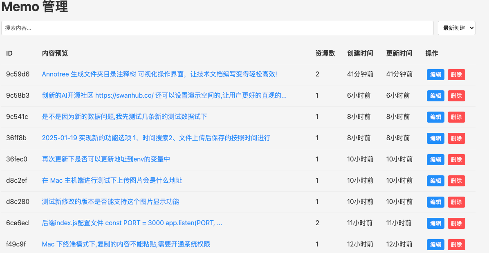
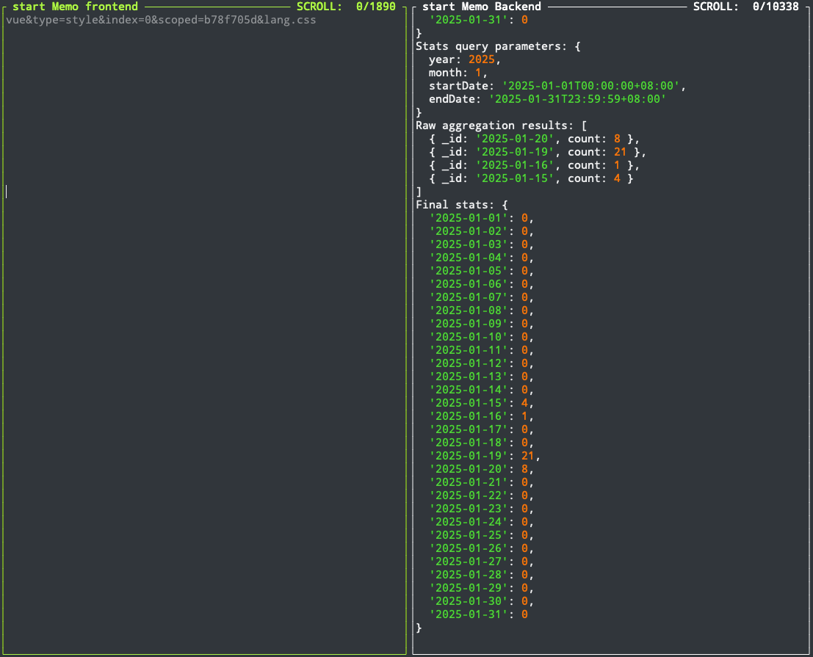

# Memo 灵感系统

一个简洁的个人灵感系统，支持 `Markdown` 格式、图片上传、贡献度统计等功能。

## 项目结构

memobbs/
├─📁 server/----------
│ ├─📁 data/---------- # 上传文件存储
│ └─📁 src/----------- # 服务器源码
│   └─📁 models/------ # 模块
└─📁 src/-------------
  ├─📁 api/----------- # API 接口
  ├─📁 components/---- # 组件
  ├─📁 router/-------- # 路由
  ├─📁 stores/-------- # 状态管理
  ├─📁 types/--------- # TypeScript 类型
  ├─📁 utils/--------- # 工具函数
  └─📁 views/--------- # 页面视图

## 功能特点

### 前台功能
- ✍️ Markdown 编辑器
- 📸 图片上传与预览
- 📅 贡献度日历展示
- 🎨 优雅的界面设计

### 后台管理
- 🔐 管理员登录认证
- 📝 Memo 内容管理
- 🖼️ 图片资源管理
- 🔍 搜索与排序功能
- 📊 分页显示

## 控制台

## 技术栈

### 前端
- Vue 3
- TypeScript
- Vue Router
- Markdown 渲染
- 自定义组件

### 后端
- Node.js
- Express
- MongoDB
- JWT 认证
- Multer 文件上传

## 安装部署

### 克隆项目 
    git clone https://github.com/your-repo/memobbs.git
### 安装依赖
    cd memobbs
    npm install
### 配置环境变量 
    cp .env.example .env
### 启动前端和后端
    npm run dev/cd server && npm run server
    访问 http://localhost:3000 接口即可使用
    访问 http://localhost:5174/ 前台展示即可使用
    访问 http://localhost:5174/admin 后台管理即可使用

## API 文档

### 前台 API
- `GET /api/memos` - 获取所有记录
- `POST /api/memos` - 创建新记录
- `POST /api/resources` - 上传资源文件
- `GET /api/memos/stats/:year/:month` - 获取月度统计

### 后台 API
- `POST /api/auth/login` - 管理员登录
- `PUT /api/memos/:id` - 更新记录
- `DELETE /api/memos/:id` - 删除记录

## 未来开发计划

- [ ] 标签管理功能
- [ ] 评论系统
- [ ] 用户系统
- [ ] 数据导入/导出
- [ ] 更多主题样式
- [ ] 移动端适配优化

## 贡献指南

欢迎提交 Issue 和 Pull Request 来帮助改进项目。

## 许可证

[MIT License](LICENSE)
## 问题相关

有任何问题欢迎提Issue,或者将问题描述发送至我邮箱 `gaviny.ge@gmail.com`.我会尽快解答.推荐提交Issue方式.  

---
 ## 致大家🙋‍♀️🙋‍♂️
 如果本项目帮助到了你，请在[这里](https://github.com/ximuer360/Memos/issues/2)留下你的网址，让更多的人看到。
您的回复将会是我继续更新维护下去的动力。 

## 捐赠
如果您觉得本项目对您有所帮助，欢迎您请我喝杯咖啡，您的支持是我最大的动力，您可以扫描下方二维码为我付款，谢谢。
### 支付宝：

    

  

### 微信：

    

